<!-- GENERATED by jahns-workflow (jw_roadmap.py) — DO NOT EDIT.
     Source of truth: tasks.yaml. Regenerated automatically on tasks.yaml edits. -->
# Roadmap — repvis

**Progress:** 3/11 done · 0 active · 0 blocked · generated 2026-07-07 06:53 UTC @ `071502a`

```mermaid
flowchart TD
    subgraph backlog["(no milestone)"]
        chore_adopt_jahns_workflow["<b>chore/adopt-jahns-workflow</b><br/>Adopt the jahns-workflow<br/>harness (config,<br/>tasks.yaml, ADR-0000,<br/>CLAUDE.md stanza,<br/>generated views)"]
        chore_push_remove_bg["<b>chore/push-remove-bg</b><br/>Push the committed<br/>remove_bg robust-masking<br/>work (be04e13) to origin<br/>after a leak scan"]
        fix_remove_bg_horizontal_planes["<b>fix/remove-bg-horizontal-planes</b><br/>remove_bg classifies large<br/>horizontal planes<br/>(floor/desk) as<br/>foreground; revisit with a<br/>geometric/semantic prior"]
        perf_parallel_joint_encode["<b>perf/parallel-joint-encode</b><br/>Parallelize phase-2 NVENC<br/>encode across GPUs to lift<br/>the ~1.5x joint multi-GPU<br/>speedup ceiling"]
        spike_fp8_attention["<b>spike/fp8-attention</b><br/>Evaluate FP8 attention for<br/>a true ~2x forward speedup<br/>versus its fidelity risk<br/>(currently unshipped)"]
        perf_bench_giant_huge_compile["<b>perf/bench-giant-huge-compile</b><br/>Benchmark FP8/compile<br/>gains for dinov2-giant and<br/>dinov3-vith16plus (huge+<br/>compile gain is only<br/>estimated ~+15%)"]
        feat_endpoint_access_control["<b>feat/endpoint-access-control</b><br/>Add access control to<br/>job/source endpoints; any<br/>reachable client that<br/>knows an id can currently<br/>fetch content"]
        feat_per_cell_bg_threshold_refit["<b>feat/per-cell-bg-threshold-refit</b><br/>Per-cell background<br/>threshold slider (live<br/>client mask) + refit-PCA-<br/>on-current-foreground<br/>button, reusing persisted<br/>features (no backbone re-<br/>run)"]
        feat_sam2_foreground_segmentation["<b>feat/sam2-foreground-segmentation</b><br/>Replace feature-clustering<br/>remove_bg with SAM2<br/>lightweight segmentation<br/>(auto DINO-saliency seed +<br/>/ - click refine, temporal<br/>propagation, mask baked<br/>into PCA video)"]
        feat_sam_autoseed_quality["<b>feat/sam-autoseed-quality</b><br/>Improve SAM2 auto-seed:<br/>single DINO-saliency point<br/>misses on some frames; try<br/>multi-point / better<br/>saliency / SAM auto-mask-<br/>gen fallback"]
        perf_sam_session_cache["<b>perf/sam-session-cache</b><br/>Persist the<br/>Sam2VideoInferenceSession<br/>/ vision features per run<br/>so +/- click re-<br/>segmentation skips<br/>recomputation and cuts<br/>click latency"]
    end
    classDef pending fill:#f5f5f5,stroke:#9e9e9e,color:#424242
    classDef active fill:#bbdefb,stroke:#1565c0,color:#0d2b56,stroke-width:2px
    classDef blocked fill:#ffcdd2,stroke:#c62828,color:#7f1d1d
    classDef done fill:#c8e6c9,stroke:#2e7d32,color:#1b4332
    classDef dropped fill:#eeeeee,stroke:#bdbdbd,color:#9e9e9e,stroke-dasharray: 4 4
    class chore_adopt_jahns_workflow,feat_per_cell_bg_threshold_refit,feat_sam2_foreground_segmentation done
    class chore_push_remove_bg,perf_parallel_joint_encode,spike_fp8_attention,perf_bench_giant_huge_compile,feat_endpoint_access_control,feat_sam_autoseed_quality,perf_sam_session_cache pending
    class fix_remove_bg_horizontal_planes dropped
```

## Tasks

| ID | Title | Status | Round | Deps | Anchor |
|---|---|---|---|---|---|
| `chore/push-remove-bg` | Push the committed remove_bg robust-masking work (be04e13) to origin after a leak scan | ⬜ pending | — | — | — |
| `feat/endpoint-access-control` | Add access control to job/source endpoints; any reachable client that knows an id can currently fetch content | ⬜ pending | — | — | — |
| `feat/sam-autoseed-quality` | Improve SAM2 auto-seed: single DINO-saliency point misses on some frames; try multi-point / better saliency / SAM auto-mask-gen fallback | ⬜ pending | — | — | — |
| `perf/bench-giant-huge-compile` | Benchmark FP8/compile gains for dinov2-giant and dinov3-vith16plus (huge+ compile gain is only estimated ~+15%) | ⬜ pending | — | — | — |
| `perf/parallel-joint-encode` | Parallelize phase-2 NVENC encode across GPUs to lift the ~1.5x joint multi-GPU speedup ceiling | ⬜ pending | — | — | — |
| `perf/sam-session-cache` | Persist the Sam2VideoInferenceSession / vision features per run so +/- click re-segmentation skips recomputation and cuts click latency | ⬜ pending | — | — | — |
| `spike/fp8-attention` | Evaluate FP8 attention for a true ~2x forward speedup versus its fidelity risk (currently unshipped) | ⬜ pending | — | — | — |
| `chore/adopt-jahns-workflow` | Adopt the jahns-workflow harness (config, tasks.yaml, ADR-0000, CLAUDE.md stanza, generated views) | ✅ done | 2026-07-07-sam2-foreground | — | — |
| `feat/per-cell-bg-threshold-refit` | Per-cell background threshold slider (live client mask) + refit-PCA-on-current-foreground button, reusing persisted features (no backbone re-run) | ✅ done | 2026-07-07-sam2-foreground | — | — |
| `feat/sam2-foreground-segmentation` | Replace feature-clustering remove_bg with SAM2 lightweight segmentation (auto DINO-saliency seed + / - click refine, temporal propagation, mask baked into PCA video) | ✅ done | 2026-07-07-sam2-foreground | — | — |
| `fix/remove-bg-horizontal-planes` | remove_bg classifies large horizontal planes (floor/desk) as foreground; revisit with a geometric/semantic prior | 🚫 dropped | — | — | — |
