<!-- GENERATED by jahns-workflow (jw_roadmap.py) — DO NOT EDIT.
     Source of truth: tasks.yaml. Regenerated automatically on tasks.yaml edits. -->
# Roadmap — repvis

**Progress:** 10/19 done · 0 active · 0 blocked · generated 2026-07-07 08:33 UTC @ `eca3b26`

```mermaid
flowchart TD
    subgraph backlog["(no milestone)"]
        chore_adopt_jahns_workflow["<b>chore/adopt-jahns-workflow</b><br/>Adopt the jahns-workflow<br/>harness (config,<br/>tasks.yaml, ADR-0000,<br/>CLAUDE.md stanza,<br/>generated views)"]
        chore_push_remove_bg["<b>chore/push-remove-bg</b><br/>Push the committed<br/>remove_bg robust-masking<br/>work (be04e13) to origin<br/>after a leak scan"]
        fix_remove_bg_horizontal_planes["<b>fix/remove-bg-horizontal-planes</b><br/>remove_bg classifies large<br/>horizontal planes<br/>(floor/desk) as<br/>foreground; revisit with a<br/>geometric/semantic prior"]
        perf_parallel_joint_encode["<b>perf/parallel-joint-encode</b><br/>Parallelize phase-2 NVENC<br/>encode across GPUs to lift<br/>the ~1.5x joint multi-GPU<br/>speedup ceiling"]
        spike_fp8_attention["<b>spike/fp8-attention</b><br/>Evaluate FP8 attention for<br/>a true ~2x forward speedup<br/>versus its fidelity risk<br/>(currently unshipped)"]
        perf_bench_giant_huge_compile["<b>perf/bench-giant-huge-compile</b><br/>Benchmark FP8/compile<br/>gains for dinov2-giant and<br/>dinov3-vith16plus (huge+<br/>compile gain is only<br/>estimated ~+15%)"]
        feat_endpoint_access_control["<b>feat/endpoint-access-control</b><br/>Add access control to<br/>job/source endpoints; any<br/>reachable client that<br/>knows an id can currently<br/>fetch content"]
        feat_per_cell_bg_threshold_refit["<b>feat/per-cell-bg-threshold-refit</b><br/>Per-cell background<br/>threshold slider (live<br/>client mask) + refit-PCA-<br/>on-current-foreground<br/>button, reusing persisted<br/>features (no backbone re-<br/>run)"]
        feat_sam2_foreground_segmentation["<b>feat/sam2-foreground-segmentation</b><br/>Replace feature-clustering<br/>remove_bg with SAM2<br/>lightweight segmentation<br/>(auto DINO-saliency seed +<br/>/ - click refine, temporal<br/>propagation, mask baked<br/>into PCA video)"]
        feat_sam_autoseed_quality["<b>feat/sam-autoseed-quality</b><br/>Improve SAM2 auto-seed:<br/>single DINO-saliency point<br/>misses on some frames; try<br/>multi-point / better<br/>saliency / SAM auto-mask-<br/>gen fallback"]
        perf_sam_session_cache["<b>perf/sam-session-cache</b><br/>Persist the<br/>Sam2VideoInferenceSession<br/>/ vision features per run<br/>so +/- click re-<br/>segmentation skips<br/>recomputation and cuts<br/>click latency"]
        fix_segment_click_frame_idx["<b>fix/segment-click-frame-idx</b><br/>Segment refine clicks<br/>always seed frame 0:<br/>client sends [x,y,label]<br/>with no frame, sam.segment<br/>uses seed_frame=0 -&gt; a<br/>click on a later frame<br/>maps coords to frame 0 and<br/>corrupts SAM propagation.<br/>Thread frame idx (point<br/>schema + per-frame<br/>prompting)"]
        fix_sam_failure_silent_fallback["<b>fix/sam-failure-silent-fallback</b><br/>SAM2 exception/empty mask<br/>is hidden as all-<br/>foreground +<br/>available=False, which<br/>also strips the client's<br/>click controls (no<br/>recovery) and lets refine<br/>failures overwrite good<br/>masks; distinguish error<br/>vs empty, keep controls,<br/>don't clobber on refine<br/>failure, add failure-mode<br/>tests (monkeypatch + mask-<br/>ratio asserts)"]
        fix_shared_model_load_lock["<b>fix/shared-model-load-lock</b><br/>extractor and SAM2<br/>from_pretrained race on<br/>torch global default<br/>dtype: their _load_lock<br/>objects are separate and<br/>run_group warms both<br/>concurrently (pipeline<br/>534-535); share ONE global<br/>model-construction lock or<br/>sequence extractor-&gt;SAM<br/>warm"]
        fix_segment_point_validation["<b>fix/segment-point-validation</b><br/>_parse_points accepts<br/>NaN/Infinity/out-of-bounds<br/>coords (shape-only check);<br/>validate finite + within<br/>the run's WxH (+ frame<br/>idx) and reject 4xx before<br/>reaching SAM2"]
        fix_run_mutation_mutex["<b>fix/run-mutation-mutex</b><br/>segment/refit re-render is<br/>not excluded from DELETE<br/>/api/runs, DELETE<br/>/api/sources, or<br/>(source,model) supersede —<br/>a concurrent delete can<br/>rmtree<br/>run_dir/feats/masks/source<br/>mid-render; track in-<br/>progress run mutations and<br/>gate destructive ops"]
        spike_frame_alignment_check["<b>spike/frame-alignment-check</b><br/>Verify 'frame alignment is<br/>exact': phase-1 GPU-decode<br/>vs SAM CPU re-decode both<br/>use seek_mode=approximate<br/>and tests only check<br/>index-length; add<br/>checksum/hash verification<br/>+ open-GOP/VFR fixtures,<br/>or reuse one decode path"]
        decision_refit_mask_grid_threshold["<b>decision/refit-mask-grid-threshold</b><br/>Is refit_and_render's adap<br/>tive_avg_pool2d(mask,grid)<br/>&gt;0.5 (drops &lt;50%-fg<br/>patches, excluding thin<br/>arms/tools/wheels from the<br/>color refit) intended, or<br/>should it use a lower<br/>threshold / soft weighting<br/>to cover thin structures?"]
        fix_refit_soft_weight_mask["<b>fix/refit-soft-weight-mask</b><br/>Replace refit's hard adapt<br/>ive_avg_pool2d(mask,grid)&<br/>gt;0.5 fg-token gate with<br/>fg-fraction SOFT WEIGHTING<br/>(weighted PCA over grid<br/>tokens) so thin structures<br/>survive the color refit;<br/>no hardcoded threshold, no<br/>user slider (per<br/>decision/refit-mask-grid-<br/>threshold ruling)"]
    end
    classDef pending fill:#f5f5f5,stroke:#9e9e9e,color:#424242
    classDef active fill:#bbdefb,stroke:#1565c0,color:#0d2b56,stroke-width:2px
    classDef blocked fill:#ffcdd2,stroke:#c62828,color:#7f1d1d
    classDef done fill:#c8e6c9,stroke:#2e7d32,color:#1b4332
    classDef dropped fill:#eeeeee,stroke:#bdbdbd,color:#9e9e9e,stroke-dasharray: 4 4
    class chore_adopt_jahns_workflow,feat_per_cell_bg_threshold_refit,feat_sam2_foreground_segmentation,fix_segment_click_frame_idx,fix_sam_failure_silent_fallback,fix_shared_model_load_lock,fix_segment_point_validation,fix_run_mutation_mutex,decision_refit_mask_grid_threshold,fix_refit_soft_weight_mask done
    class chore_push_remove_bg,perf_parallel_joint_encode,spike_fp8_attention,perf_bench_giant_huge_compile,feat_endpoint_access_control,feat_sam_autoseed_quality,perf_sam_session_cache,spike_frame_alignment_check pending
    class fix_remove_bg_horizontal_planes dropped
```

## Tasks

| ID | Title | Status | Round | Deps | Anchor |
|---|---|---|---|---|---|
| `chore/push-remove-bg` | Push the committed remove_bg robust-masking work (be04e13) to origin after a leak scan | ⬜ pending | — | — | — |
| `feat/endpoint-access-control` | Add access control to job/source endpoints; any reachable client that knows an id can currently fetch content | ⬜ pending | — | — | — |
| `feat/sam-autoseed-quality` | Improve SAM2 auto-seed: single DINO-saliency point misses on some frames; try multi-point / better saliency / SAM auto-mask-gen fallback | ⬜ pending | — | — | — |
| `perf/bench-giant-huge-compile` | Benchmark FP8/compile gains for dinov2-giant and dinov3-vith16plus (huge+ compile gain is only estimated ~+15%) | ⬜ pending | — | — | — |
| `perf/parallel-joint-encode` | Parallelize phase-2 NVENC encode across GPUs to lift the ~1.5x joint multi-GPU speedup ceiling | ⬜ pending | — | — | — |
| `perf/sam-session-cache` | Persist the Sam2VideoInferenceSession / vision features per run so +/- click re-segmentation skips recomputation and cuts click latency | ⬜ pending | — | — | — |
| `spike/fp8-attention` | Evaluate FP8 attention for a true ~2x forward speedup versus its fidelity risk (currently unshipped) | ⬜ pending | — | — | — |
| `spike/frame-alignment-check` | Verify 'frame alignment is exact': phase-1 GPU-decode vs SAM CPU re-decode both use seek_mode=approximate and tests only check index-length; add checksum/hash verification + open-GOP/VFR fixtures, or reuse one decode path | ⬜ pending | — | — | — |
| `chore/adopt-jahns-workflow` | Adopt the jahns-workflow harness (config, tasks.yaml, ADR-0000, CLAUDE.md stanza, generated views) | ✅ done | 2026-07-07-sam2-foreground | — | — |
| `decision/refit-mask-grid-threshold` | Is refit_and_render's adaptive_avg_pool2d(mask,grid)>0.5 (drops <50%-fg patches, excluding thin arms/tools/wheels from the color refit) intended, or should it use a lower threshold / soft weighting to cover thin structures? | ✅ done | — | — | — |
| `feat/per-cell-bg-threshold-refit` | Per-cell background threshold slider (live client mask) + refit-PCA-on-current-foreground button, reusing persisted features (no backbone re-run) | ✅ done | 2026-07-07-sam2-foreground | — | — |
| `feat/sam2-foreground-segmentation` | Replace feature-clustering remove_bg with SAM2 lightweight segmentation (auto DINO-saliency seed + / - click refine, temporal propagation, mask baked into PCA video) | ✅ done | 2026-07-07-sam2-foreground | — | — |
| `fix/refit-soft-weight-mask` | Replace refit's hard adaptive_avg_pool2d(mask,grid)>0.5 fg-token gate with fg-fraction SOFT WEIGHTING (weighted PCA over grid tokens) so thin structures survive the color refit; no hardcoded threshold, no user slider (per decision/refit-mask-grid-threshold ruling) | ✅ done | — | — | — |
| `fix/run-mutation-mutex` | segment/refit re-render is not excluded from DELETE /api/runs, DELETE /api/sources, or (source,model) supersede — a concurrent delete can rmtree run_dir/feats/masks/source mid-render; track in-progress run mutations and gate destructive ops | ✅ done | — | — | — |
| `fix/sam-failure-silent-fallback` | SAM2 exception/empty mask is hidden as all-foreground + available=False, which also strips the client's click controls (no recovery) and lets refine failures overwrite good masks; distinguish error vs empty, keep controls, don't clobber on refine failure, add failure-mode tests (monkeypatch + mask-ratio asserts) | ✅ done | — | — | — |
| `fix/segment-click-frame-idx` | Segment refine clicks always seed frame 0: client sends [x,y,label] with no frame, sam.segment uses seed_frame=0 -> a click on a later frame maps coords to frame 0 and corrupts SAM propagation. Thread frame idx (point schema + per-frame prompting) | ✅ done | — | — | — |
| `fix/segment-point-validation` | _parse_points accepts NaN/Infinity/out-of-bounds coords (shape-only check); validate finite + within the run's WxH (+ frame idx) and reject 4xx before reaching SAM2 | ✅ done | — | — | — |
| `fix/shared-model-load-lock` | extractor and SAM2 from_pretrained race on torch global default dtype: their _load_lock objects are separate and run_group warms both concurrently (pipeline 534-535); share ONE global model-construction lock or sequence extractor->SAM warm | ✅ done | — | — | — |
| `fix/remove-bg-horizontal-planes` | remove_bg classifies large horizontal planes (floor/desk) as foreground; revisit with a geometric/semantic prior | 🚫 dropped | — | — | — |
